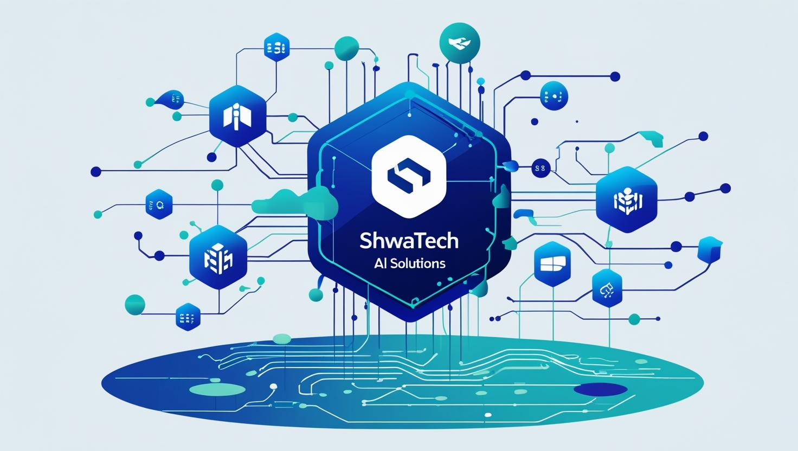

# MINI-RAG-APP

This Is a Comprehensive Implementation of RAG (Retrieval Augmented Generation) From Absolute Scratch Using Python, FastAPI, Qdrant as VectorDB, (MongoDB - PostgreSQL, pgvector, SqlAlchemy) as Main DB, Groq as LLM, Gemini Embeddings and Recently Adding Task Queue System (Celery + Redis + RabbitMQ) With Deployment Using Github Actions and Docker.



## Project Structure

```bash
MINI-RAG-APP/
├── mongodb/
│   ├── docker/
│   │   └── docker-compose.yml
│   ├── src/
│   │   ├── main.py
│   │   ├── models/
│   │   ├── routes/
│   │   └── utils/
│   └── .env
├── postgresql/
│   ├── docker/
│   │   └── docker-compose.yml
│   ├── src/
│   │   ├── main.py
│   │   ├── models/
│   │   ├── routes/
│   │   └── utils/
│   └── .env
└── .github/
    └── workflows/
        └── deploy-main.yml
```

### MongoDB

```bash
# Navigate to the MongoDB directory
cd mongodb

# Start the MongoDB container
docker-compose up -d
```

### PostgreSQL

```bash
# Navigate to the PostgreSQL directory
cd postgresql

# Start the PostgreSQL container
docker-compose up -d
```
